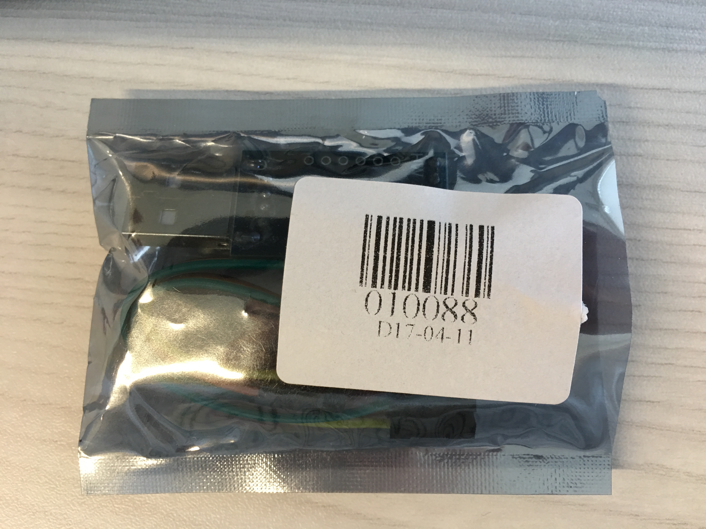
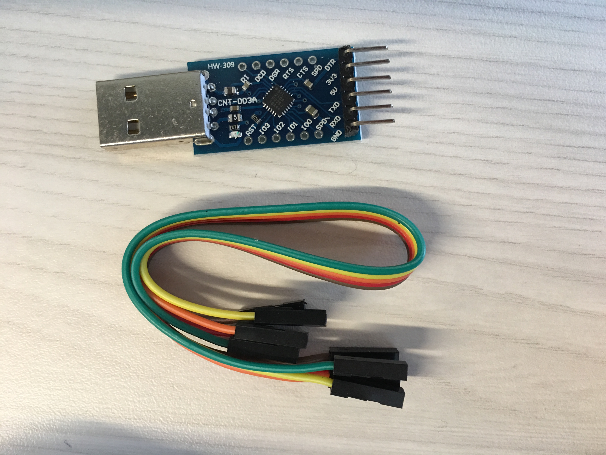
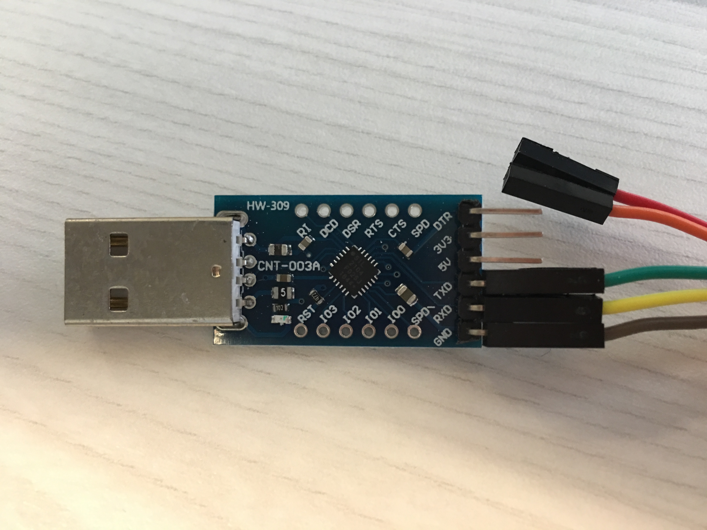
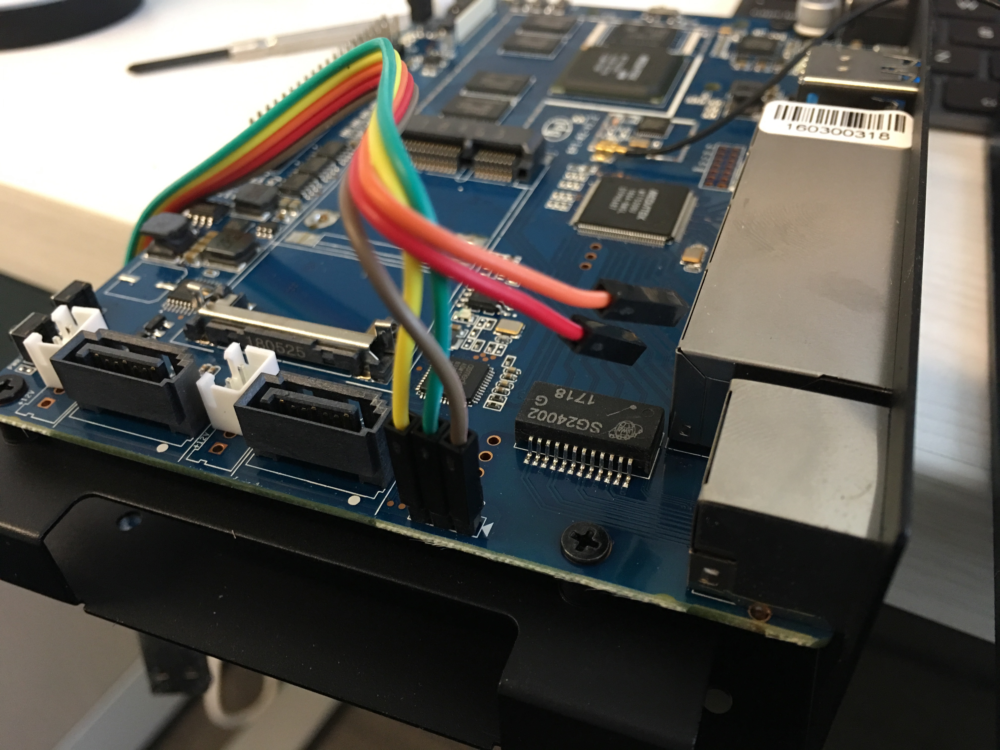
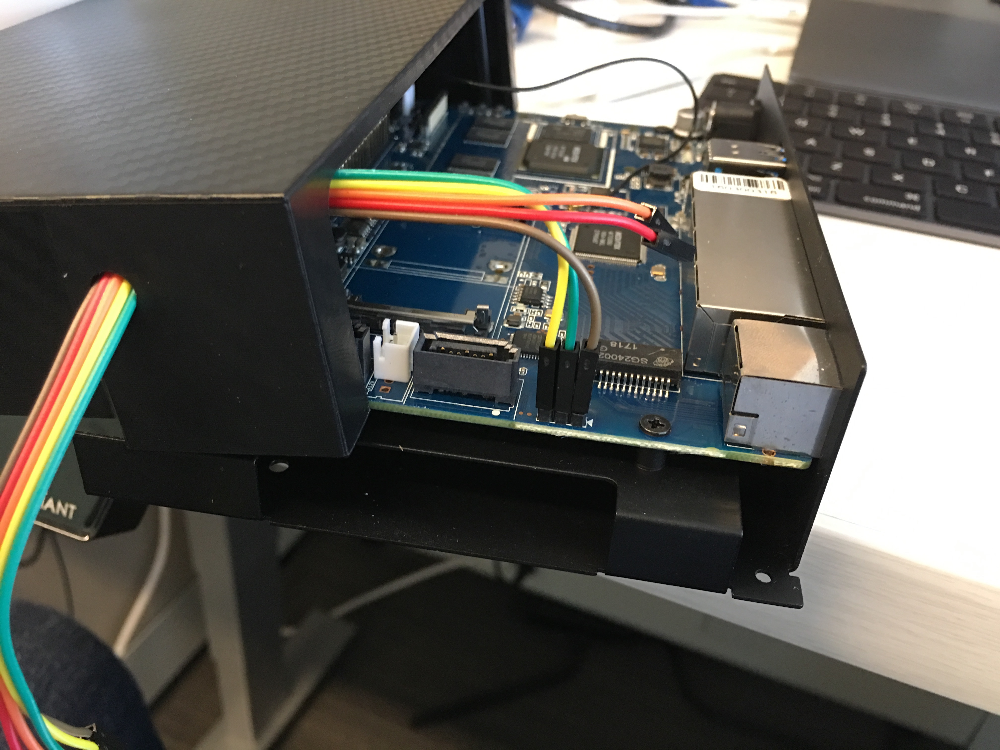
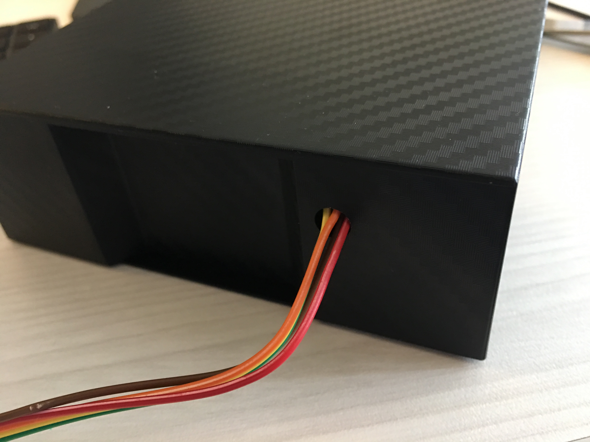

# Banana Pi R2 UART

## Serial UART Info

**Description**

USB 2.0 to TTL UART
6PIN Module Serial
Converter CP2104 STC 
PRGMR Than CP2102 
With Free Dupont Cables

**Supplier**

深圳市四海芯舟科技有限公司	
czb8866@hotmail.com

## Physical Connection

| UART | COLOR  | BPI-R2 |
|------|--------|--------|
| DTR  | -      | -      |
| 3V3  | -      | -      |
| 5V   | -      | -      |
| TXD  | GREEN  | RX     |
| RXD  | YELLOW | TX     |
| GND  | BROWN  | GND    |

## Silicon Labs Driver 

<https://www.silabs.com/products/development-tools/software/usb-to-uart-bridge-vcp-drivers>

## Minicom

```
brew install minicom
minicom -s
```

### Minicom Settings

<https://www.fw-web.de/dokuwiki/doku.php?id=en:bpi-r2:debug-uart>

| Menu Item         | Setting               | Value                   |
|-------------------|-----------------------|-------------------------|
| Serial Port Setup | Serial Device         | /dev/tty.SLAB_USBtoUART |
|                   | Bps/Par/Bits          | 115200 8N1              |
|                   | Hardware Flow Control | No                      |
|                   | Software Flow Control | No                      |

### Minicom Config File

```
[shay@norvig-1159 ~ $] cat .minirc.dfl 
# Machine-generated file - use "minicom -s" to change parameters.
pu port             /dev/tty.SLAB_USBtoUART
pu baudrate         115200
pu bits             8
pu parity           N
pu stopbits         1
pu escape-key       Escape (Meta)
pu xonxoff          No
pu rtscts           No
```

### Exiting Minicom

- [ESC]-Z brings the menu. Q quits.

## Pictures







## Example Output

```console
[USBD] USB PRB0 LineState: 0

[USBD] USB cable/ No Cable inserted!

[PLFM] Keep stay in USB Mode
Platform initialization is ok
wait for frequency meter finish, CLK26CALI = 0x81
mt_pll_post_init: mt_get_cpu_freq = 1040000Khz
wait for frequency meter finish, CLK26CALI = 0x90
mt_pll_post_init: mt_get_bus_freq = 273000Khz
wait for frequency meter finish, CLK26CALI = 0x81
mt_pll_post_init: mt_get_mem_freq = 133250Khz
[PWRAP] pwrap_init_preloader
[PWRAP] pwrap_init
[PWRAP] _pwrap_init_sistrobe [Read Test] fail,index=0,rdata=2D52
[PWRAP] _pwrap_init_sistrobe [Read Test] fail,index=1,rdata=2D52
[PWRAP] _pwrap_init_sistrobe [Read Test] fail,index=2,rdata=2D52
[PWRAP] _pwrap_init_sistrobe [Read Test] fail,index=3,rdata=800
[PWRAP] _pwrap_init_sistrobe [Read Test] pass,index=4 rdata=5AA5
[PWRAP] _pwrap_init_sistrobe [Read Test] pass,index=5 rdata=5AA5
[PWRAP] _pwrap_init_sistrobe [Read Test] pass,index=6 rdata=5AA5
[PWRAP] _pwrap_init_sistrobe [Read Test] pass,index=7 rdata=5AA5
[PWRAP] _pwrap_init_sistrobe [Read Test] pass,index=8 rdata=5AA5                
[PWRAP] _pwrap_init_sistrobe [Read Test] pass,index=9 rdata=5AA5                
[PWRAP] _pwrap_init_sistrobe [Read Test] pass,index=10 rdata=5AA5               
[PWRAP] _pwrap_init_sistrobe [Read Test] fail,index=11,rdata=1001               
[PWRAP] _pwrap_init_sistrobe [Read Test] fail,index=12,rdata=B54B               
[PWRAP] _pwrap_init_sistrobe [Read Test] fail,index=13,rdata=B54B               
[PWRAP] _pwrap_init_sistrobe [Read Test] fail,index=14,rdata=B54B               
[PWRAP] _pwrap_init_sistrobe [Read Test] fail,index=15,rdata=B54B               
[PWRAP] _pwrap_init_sistrobe [Read Test] fail,index=16,rdata=B54B               
[PWRAP] _pwrap_init_sistrobe [Read Test] fail,index=17,rdata=B54B               
[PWRAP] _pwrap_init_sistrobe [Read Test] fail,index=18,rdata=B54B               
[PWRAP] _pwrap_init_sistrobe [Read Test] fail,index=19,rdata=2003               
[PWRAP] _pwrap_init_sistrobe [Read Test] fail,index=20,rdata=6A97               
[PWRAP] _pwrap_init_sistrobe [Read Test] fail,index=21,rdata=6A97               
[PWRAP] _pwrap_init_sistrobe [Read Test] fail,index=22,rdata=6A97               
[PWRAP] _pwrap_init_sistrobe [Read Test] fail,index=23,rdata=6A97               
[PWRAP] _pwrap_init_reg_clock                                                   
[PMIC_WRAP]wrap_init pass,the return value=0.                                   
[pmic6323_init] Preloader Start..................                               
[pmic6323_init] PMIC CHIP Code = 0x2023                                         
INT_MISC_CON: 0  TOP_RST_MISC: 0                                                
pl pmic powerkey Press                                                          
[pmic6323_init] powerKey = 1                                                    
[pmic6323_init] is USB in = 0xB004                                              
[pmic6323_init] Reg[0x11A]=0x1B                                                 
pmic setup LED                                                                  
[pmic6323_init] Done...................                                         
mt7623 disable long press reset ->>>>>                                          
mt7623 disable long press reset <<<<<-                                          
mt7623 VPA supplied by 1.0V to MT7530 ->                                        
mt7623 VPA supplied by 1.0V to MT7530 <-                                        
mt7623 enables RG_VGP1_EN for LCM ->                                            
mt7623 enables RG_VGP1_EN for LCM <-                                            
MT7623 E2 setting =>                                                            
MT7623 E2 setting <=                                                            
[PLFM] Init I2C: OK(0)                                                          
[PLFM] Init PWRAP: OK(0)                                                        
[PLFM] Init PMIC: OK(0)                                                         
[PLFM] chip[CA00]                                                               
                                                                                
[BLDR] [Support SD/eMMC] Build Time: 20170210-093340                            
==== Dump RGU Reg ========                                                      
RGU MODE:     4D                                                                
RGU LENGTH:   FFE0                                                              
RGU STA:      0                                                                 
RGU INTERVAL: FFF                                                               
RGU SWSYSRST: 0                                                                 
==== Dump RGU Reg End ====                                                      
RGU: g_rgu_satus:0                                                              
 mtk_wdt_mode_config  mode value=10, tmp:22000010                               
PL P ON                                                                         
WDT does not trigger reboot                                                     
RGU mtk_wdt_init:MTK_WDT_DEBUG_CTL(590200F3)                                    
kpd read addr: 0x0040: data:0x4001                                              
Enter mtk_kpd_gpio_set!                                                         
kpd debug column : 0, 0, 0, 0, 0, 0, 0, 0                                       
kpd debug row : 0, 0, 0, 0, 0, 0, 0, 0                                          
after set KP enable: KP_SEL = 0x0 !                                             
MTK_PMIC_RST_KEY is used for this project!                                      
[RTC] get_frequency_meter: input=0x0, ouput=5                                   
[RTC] get_frequency_meter: input=0x0, ouput=3967                                
[RTC] get_frequency_meter: input=0x0, ouput=5                                   
[RTC] get_frequency_meter: input=0x0, ouput=0                                   
[RTC] get_frequency_meter: input=0x0, ouput=0                                   
[RTC] bbpu = 0x4, con = 0xBBFE                                                  
rtc_first_boot_init                                                             
[RTC] get_frequency_meter: input=0x0, ouput=5                                   
[RTC] get_frequency_meter: input=0x0, ouput=3967                                
[RTC] get_frequency_meter: input=0x0, ouput=5                                   
[RTC] get_frequency_meter: input=0x0, ouput=0                                   
[RTC] get_frequency_meter: input=0x0, ouput=0                                   
rtc_2sec_stat_clear                                                             
rtc_2sec_reboot_check cali=768                                                  
rtc_2sec_stat_clear                                                             
[RTC] irqsta = 0x0, pdn1 = 0x0, pdn2 = 0x201, spar0 = 0xC0, spar1 = 0x800       
[RTC] new_spare0 = 0x0, new_spare1 = 0x1, new_spare2 = 0x1, new_spare3 = 0x1    
[RTC] bbpu = 0x4, con = 0x426, cali = 0x300                                     
pl pmic powerkey Press                                                          
power key is pressed                                                            
[PLFM] Power key boot!                                                          
[RTC] rtc_bbpu_power_on done                                                    
[EMI] mcp_dram_num:0,discrete_dram_num:1,enable_combo_dis:0                     
[EMI] PCDDR3                                                                    
[Check]mt_get_mdl_number 0x0                                                    
[EMI] eMMC/NAND ID = 0,0,0,0,0,0,0,0,0,0,0,0,0,0,0,0                            
[EMI] MDL number = 0                                                            
[EMI] emi_set eMMC/NAND ID = 0,0,0,0,0,0,0,0,0,0,0,0,0,0,0,0                    
[EMI][Vcore]0x21E=0x48,0x220=0x48                                               
[EMI][Vmem]0x554=0x0                                                            
wait for frequency meter finish, CLK26CALI = 0x81                               
[EMI] PCDDR3 DRAM Clock = 1333004 KHz, MEMPLL MODE = 2                          
[EMI] PCDDR3 RXTDN Calibration:                                                 
Start REXTDN SW calibration...                                                  
drvp=0xB,drvn=0x9                                                               
[EMI] pinmux = 4                                                                
=============================================================================== 
                                                                                
        dramc_write_leveling_swcal                                              
=============================================================================== 
delay  byte0  byte1  byte2  byte3                                               
-----------------------------                                                   
0    1    1    1    1                                                           
1    1    1    1    1                                                           
2    1    1    1    1                                                           
3    1    1    1    1                                                           
4    1    1    1    1                                                           
5    1    1    1    1                                                           
6    1    1    1    1                                                           
7    1    1    1    1                                                           
8    1    1    1    1                                                           
9    1    1    1    1                                                           
10    1    1    1    1                                                          
11    1    1    1    1                                                          
12    1    1    1    1                                                          
13    1    1    1    1                                                          
14    1    1    1    1                                                          
15    1    1    1    1                                                          
pass bytecount = 4                                                              
byte_i    status    best delay                                                  
0    2    0                                                                     
1    2    0                                                                     
2    2    0                                                                     
3    2    0                                                                     
========================================                                        
[write leveling]DQS: 0x0, DQM: 0x0                                              
[write leveling after remap]DQ byte0 reg: 0x200 val: 0x0                        
[write leveling after remap]DQ byte1 reg: 0x204 val: 0x0                        
[write leveling after remap]DQ byte2 reg: 0x208 val: 0x0                        
[write leveling after remap]DQ byte3 reg: 0x20C val: 0x0                        
=============================================                                   
X-axis: DQS Gating Window Delay (Fine Scale)                                    
Y-axis: DQS Gating Window Delay (Coarse Scale)                                  
=============================================                                   
          0    8   16   24   32   40   48   56   64   72   80   88   96  104  10
      --------------------------------------------------------------------------
0000:|    0    0    0    0    0    0    0    0    0    0    0    0    0    0   0
0001:|    0    0    0    0    0    0    0    0    0    0    0    0    0    0   0
0002:|    0    0    0    0    0    0    0    0    0    0    0    0    0    0   0
0003:|    0    0    0    0    0    0    0    0    0    0    0    0    0    0   0
0004:|    0    0    0    0    0    0    0    0    0    0    0    0    0    0   0
0005:|    0    0    0    0    0    0    0    0    0    0    0    0    0    0   0
0006:|    0    0    0    0    0    0    0    0    0    0    0    0    0    0   0
0007:|    0    0    0    0    0    0    0    0    0    0    0    0    0    0   0
0008:|    0    0    0    0    0    0    0    0    0    0    0    0    0    0   0
0009:|    0    0    0    0    0    0    0    0    0    0    0    0    0    0   0
000A:|    0    0    0    0    0    0    0    0    0    0    0    0    0    0   0
000B:|    0    0    0    0    0    0    0    0    0    0    0    0    0    0   0
000C:|    0    0    0    0    0    0    0    0    0    0    0    0    0    0   0
000D:|    0    0    0    0    0    0    0    0    0    0    0    0    0    0   0
000E:|    0    0    0    0    0    0    0    0    0    0    0    0    0    0   0
000F:|    0    0    0    0    0    0    0    0    0    0    0    0    0    0   0
0010:|    0    0    0    0    0    0    0    0    0    0    0    0    0    0   1
0011:|    0    0    0    0    0    0    0    0    0    1    1    1    1    1   1
0012:|    0    0    1    1    1    1    1    1    1    1    1    1    1    1   0
0013:|    1    1    1    1    1    1    1    1    0    0    0    0    0    0   0
0014:|    1    1    0    0    0    0    0    0    0    0    0    0    0    0   0
0015:|    0    0    0    0    0    0    0    0    0    0    0    0    0    0   0
0016:|    0    0    0    0    0    0    0    0    0    0    0    0    0    0   0
0017:|    0    0    0    0    0    0    0    0    0    0    0    0    0    0   0
0018:|    0    0    0    0    0    0    0    0    0    0    0    0    0    0   0
0019:|    0    0    0    0    0    0    0    0    0    0    0    0    0    0   0
001A:|    0    0    0    0    0    0    0    0    0    0    0    0    0    0   0
001B:|    0    0    0    0    0    0    0    0    0    0    0    0    0    0   0
001C:|    0    0    0    0    0    0    0    0    0    0    0    0    0    0   0
001D:|    0    0    0    0    0    0    0    0    0    0    0    0    0    0   0
001E:|    0    0    0    0    0    0    0    0    0    0    0    0    0    0   0
001F:|    0    0    0    0    0    0    0    0    0    0    0    0    0    0   0
Rank 0 coarse tune value selection : 18, 18                                     
18                                                                              
56                                                                              
rank 0 coarse = 18                                                              
rank 0 fine = 56                                                                
00:|    0    0    0    0    0    0    0    1    1    1    1    0                
opt_dle value:12                                                                
==================================================================              
                RX      DQS perbit delay software calibration                   
==================================================================              
1.0-31 bit dq delay value                                                       
==================================================================              
bit|     0  1  2  3  4  5  6  7  8  9                                           
--------------------------------------                                          
0 |    0 0 0 0 0 0 0 0 0 0                                                      
10 |    0 0 0 0 0 0 0 0 0 0                                                     
20 |    0 0 0 0 0 0 0 0 0 0                                                     
30 |    0 0                                                                     
--------------------------------------                                          
==================================================================              
2.dqs window                                                                    
x=pass dqs delay value (min~max)center                                          
y=0-7bit DQ of every group                                                      
input delay:DQS0 =51 DQS1 = 42 DQS2 =54 DQS3 = 50                               
==================================================================              
bit     DQS0     bit      DQS1     bit     DQS2     bit     DQS3                
0  (16~78)47  8  (8~68)38  16  (21~78)49  24  (16~70)43                         
1  (16~77)46  9  (7~67)37  17  (21~78)49  25  (16~71)43                         
2  (17~80)48  10  (11~72)41  18  (23~80)51  26  (17~76)46                       
3  (16~76)46  11  (11~68)39  19  (18~76)47  27  (17~72)44                       
4  (18~79)48  12  (13~72)42  20  (23~86)54  28  (22~78)50                       
5  (16~79)47  13  (11~68)39  21  (23~82)52  29  (19~75)47                       
6  (17~76)46  14  (10~69)39  22  (23~80)51  30  (16~70)43                       
7  (21~81)51  15  (13~69)41  23  (25~84)54  31  (20~78)49                       
==================================================================              
3.dq delay value last                                                           
==================================================================              
bit|    0  1  2  3  4  5  6  7  8   9                                           
--------------------------------------                                          
0 |    4 5 3 5 3 4 5 0 4 5                                                      
10 |    1 3 0 3 3 1 5 5 3 7                                                     
20 |    0 2 3 0 7 7 4 6 0 3                                                     
30 |    7 1                                                                     
==================================================================              
*DQIDLY1 = 0x5030504                                                            
*DQIDLY2 = 0x50403                                                              
*DQIDLY3 = 0x3010504                                                            
*DQIDLY4 = 0x1030300                                                            
*DQIDLY5 = 0x7030505                                                            
*DQIDLY6 = 0x30200                                                              
*DQIDLY7 = 0x6040707                                                            
*DQIDLY8 = 0x1070300                                                            
*DRAMC_R0DELDLY = 0x32362A33                                                    
                                                                                
[MEM]CONA:F3A2,conf1:F07486A3                                                   
DM4BitMux = 1                                                                   
DQSO 0 in TX per-bit = 0 <= DQSO 0 in WL = 0                                    
DQSO 1 in TX per-bit = 0 <= DQSO 1 in WL = 0                                    
[Warning] DQSO 2 in TX per-bit = 2 > DQSO 2 in WL = 0                           
[Warning] DQSO 3 in TX per-bit = 3 > DQSO 3 in WL = 0                           
Tx DQM dly  = 0x1052                                                            
Tx DQM dly bit4 = 0x0                                                           
DRAMC_DQODLY1=13325665h                                                         
DRAMC_DQODLY2=57444233h                                                         
DRAMC_DQODLY3=112110h                                                           
DRAMC_DQODLY4=22002012h                                                         
Tx DQ dly bit4 = 0x0                                                            
Tx DQS dly = 0x3200                                                             
Tx DQS dly bit4 = 0x0                                                           
TX Byte0: DQ - 20, DQS - 16. win_sum= 35                                        
TX Byte1: DQ - 23, DQS - 12. win_sum= 34                                        
TX Byte2: DQ - 16, DQS - 18. win_sum= 33                                        
TX Byte3: DQ - 15, DQS - 20. win_sum= 34                                        
DRAMC calibration takes 650113046 CPU cycles                                    
                                                                                
[EMI] DRAMC calibration passed                                                  
                                                                                
[MEM] complex R/W mem test pass                                                 
0:dram_rank_size:80000000                                                       
[Dram_Buffer] dram size:-2147483648                                             
[Dram_Buffer] structure size: 1725560                                           
[Dram_Buffer] MAX_TEE_DRAM_SIZE: 0                                              
Boot from SD Card!!                                                             
[PLFM] Init Boot Device: OK(0)                                                  
                                                                                
[PART] blksz: 512B                                                              
[PART] [0x0000000000000000-0x000000000003FFFF] "PRELOADER" (512 blocks)         
[PART] [0x0000000000000000-0x000000000003FFFF] "MBR" (512 blocks)               
[PART] [0x0000000000040000-0x00000000000BFFFF] "UBOOT" (1024 blocks)            
[PART] [0x00000000000C0000-0x00000000000FFFFF] "CONFIG" (512 blocks)            
[PART] [0x0000000000100000-0x000000000013FFFF] "FACTORY" (512 blocks)           
[PART] [0x0000000000140000-0x000000000213FFFF] "BOOTIMG" (65536 blocks)         
[PART] [0x0000000002140000-0x000000000413FFFF] "RECOVERY" (65536 blocks)        
[PART] [0x0000000004140000-0x000000004413FFFF] "ROOTFS" (2097152 blocks)        
[PART] [0x0000000044140000-0x000001FFC413FFFF] "USER" (-4194304 blocks)         
[platform_vusb_on] PASS                                                         
[TOOL] PMIC not dectect usb cable!                                              
[TOOL] <UART> listen  ended, receive size:0!                                    
[TOOL] <UART> wait sync time 150ms->5ms                                         
[TOOL] <UART> receieved data: ()                                                
                                                                                
Device APC domain init setup:                                                   
                                                                                
 bootloader load uboot ,the address of uboot is 81E00000                        
[PART]partition name UBOOT                                                      
[PART]partition start block 0x200                                               
[PART]partition size 0x80000                                                    
[PART]partition blks 0x400                                                      
[PART]partition flags 0x0                                                       
[PART]partition name 0x8                                                        
[bean] part->startblk(0x200) bdev->blksz(0x200) part->part_id(8) hdr(0xFFB50000)
[BlkDev.c 101 ]partition block size 0x200 ,blks:0xECE000                        
[BlkDev.c 101 ]partition block erase size 0x200                                 
                                                                                
[PART] load "UBOOT" from 0x0000000000050000 (dev) to 0x81E00000 (mem) [SUCCESS] 
[PART] load speed: 6103KB/s, 300000 bytes, 48ms                                 
[BT_SD_PG] device info 0x8590 0x8A00 0xCB01 0x102                               
0:dram_rank_size:80000000                                                       
[PLFM] md_type[0] = 255                                                         
[PLFM] md_type[1] = 255                                                         
                                                                                
[PLFM] boot reason: 0                                                           
[PLFM] boot mode: 0                                                             
[PLFM] META COM0: 0                                                             
[PLFM] <0xFFB7CC10>: 0x0                                                        
[PLFM] boot time: 2944ms                                                        
[PLFM] DDR reserve mode: enable = 0, success = 0                                
                                                                                
[BLDR] jump to 0x81E00000                                                       
[BLDR] <0x81E00000>=0xEA00000F                                                  
[BLDR] <0x81E00004>=0xE59FF014                                                  
                                                                                
                                                                                
U-Boot  (May 27 2018 - 19:51:50)                                                
                                                                                
================== Iverson debug. ===========================                   
g_nr_bank = 1.                                                                  
g_total_rank_size = 0x80000000                                                  
DRAM:  2 GiB                                                                    
WARNING: Caches not enabled                                                     
Boot From SD(id:1)                                                              
                                                                                
dev_num = 1                                                                     
***size=4096, offset=4190111232, blk_start=8183811, blk_cnt=8                   
*** Warning - bad CRC, using default environment                                
                                                                                
In:    serial                                                                   
Out:   serial                                                                   
Err:   serial                                                                   
Boot From SD(id:1)                                                              
                                                                                
dev_num = 1                                                                     
***size=4096, offset=4190111232, blk_start=8183811, blk_cnt=8                   
*** Warning - bad CRC, using default environment                                
                                                                                
bootargs = board=bpi-r2 earlyprintk console=tty1 fbcon=map:0 console=ttyS0,1152t
Net:   mtk_eth                                                                  
Uip activated                                                                   


  *** U-Boot Boot Menu ***

     1. Reload Bootmenu.
     2. Load Environment.
     3. Boot Linux from SD.
     4. Boot Kernel 4.4.
     5. Boot Kernel 4.9.
     6. Boot Kernel 4.14.
     7. Boot Kernel 4.16.
     U-Boot console

  Hit any key to stop autoboot:  1 
  Press UP/DOWN to move, ENTER to select


BPI: SD/eMMC SD=1 eMMC=0 id = 1 (drivers/mmc/mediatek/mtk_mmc.c)
__mmc_init ret = 0
ret2 = 1
ret2 = 1
BPI: g_mtk_mmc_block.dev = 1
<= [mmc1 block 0] =>
[0x00000000] 53 44 4d 4d 43 5f 42 4f
[0x00000008] 4f 54 00 00 01 00 00 00
[0x00000010] 00 02 00 00 ff ff ff ff
[0x00000018] ff ff ff ff ff ff ff ff
[0x00000020] ff ff ff ff ff ff ff ff
[0x00000028] ff ff ff ff ff ff ff ff
[0x00000030] ff ff ff ff ff ff ff ff
[0x00000038] ff ff ff ff ff ff ff ff
[0x00000040] ff ff ff ff ff ff ff ff
[0x00000048] ff ff ff ff ff ff ff ff
[0x00000050] ff ff ff ff ff ff ff ff
[0x00000058] ff ff ff ff ff ff ff ff
[0x00000060] ff ff ff ff ff ff ff ff
[0x00000068] ff ff ff ff ff ff ff ff
[0x00000070] ff ff ff ff ff ff ff ff
[0x00000078] ff ff ff ff ff ff ff ff
[0x00000080] ff ff ff ff ff ff ff ff
[0x00000088] ff ff ff ff ff ff ff ff
[0x00000090] ff ff ff ff ff ff ff ff
[0x00000098] ff ff ff ff ff ff ff ff
[0x000000a0] ff ff ff ff ff ff ff ff
[0x000000a8] ff ff ff ff ff ff ff ff
[0x000000b0] ff ff ff ff ff ff ff ff
[0x000000b8] ff ff ff ff ff ff ff ff
[0x000000c0] ff ff ff ff ff ff ff ff
[0x000000c8] ff ff ff ff ff ff ff ff
[0x000000d0] ff ff ff ff ff ff ff ff
[0x000000d8] ff ff ff ff ff ff ff ff
[0x000000e0] ff ff ff ff ff ff ff ff
[0x000000e8] ff ff ff ff ff ff ff ff
[0x000000f0] ff ff ff ff ff ff ff ff
[0x000000f8] ff ff ff ff ff ff ff ff
[0x00000100] ff ff ff ff ff ff ff ff
[0x00000108] ff ff ff ff ff ff ff ff
[0x00000110] ff ff ff ff ff ff ff ff
[0x00000118] ff ff ff ff ff ff ff ff
[0x00000120] ff ff ff ff ff ff ff ff
[0x00000128] ff ff ff ff ff ff ff ff
[0x00000130] ff ff ff ff ff ff ff ff
[0x00000138] ff ff ff ff ff ff ff ff
[0x00000140] ff ff ff ff ff ff ff ff
[0x00000148] ff ff ff ff ff ff ff ff
[0x00000150] ff ff ff ff ff ff ff ff
[0x00000158] ff ff ff ff ff ff ff ff
[0x00000160] ff ff ff ff ff ff ff ff
[0x00000168] ff ff ff ff ff ff ff ff
[0x00000170] ff ff ff ff ff ff ff ff
[0x00000178] ff ff ff ff ff ff ff ff
[0x00000180] ff ff ff ff ff ff ff ff
[0x00000188] ff ff ff ff ff ff ff ff
[0x00000190] ff ff ff ff ff ff ff ff
[0x00000198] ff ff ff ff ff ff ff ff
[0x000001a0] ff ff ff ff ff ff ff ff
[0x000001a8] ff ff ff ff ff ff ff ff
[0x000001b0] ff ff ff ff ff ff ff ff
[0x000001b8] cd d6 0e 00 00 00 00 be
[0x000001c0] 33 0c 0c 61 34 2d 00 20
[0x000001c8] 03 00 00 00 08 00 00 61
[0x000001d0] 35 2d 83 81 cb b6 00 20
[0x000001d8] 0b 00 00 e0 dd 00 00 00
[0x000001e0] 00 00 00 00 00 00 00 00
[0x000001e8] 00 00 00 00 00 00 00 00
[0x000001f0] 00 00 00 00 00 00 00 00
[0x000001f8] 00 00 00 00 00 00 55 aa

Partition Map for MMC device 1  --   Partition Type: DOS

Part    Start Sector    Num Sectors     UUID            Type
  1     204800          524288          000ed6cd-01     0c
  2     729088          14540800        000ed6cd-02     83
mmc1 is available

Interface:  MMC
  Device 1: Vendor: Man 000003 Snr d60f9100 Rev: 15.1 Prod: SL08G?
            Type: Removable Hard Disk
            Capacity: 7580.0 MB = 7.4 GB (15523840 x 512)

Filesystem: FAT16 "BPI-BOOT   "
Boot from SD
reading bananapi/bpi-r2/linux/uEnv.txt

1645 bytes read in 8 ms (200.2 KiB/s)
Loaded environment from uEnv.txt
Banana Pi bpi-r2 chip: mt7623n Service: linux

reading bananapi/bpi-r2/linux/uImage

6474926 bytes read in 831 ms (7.4 MiB/s)
reading bananapi/berryboot.img
** Unable to read file bananapi/berryboot.img **
bootm flag=0, states=70f
## Booting kernel from Legacy Image at 84000000 ...
   Image Name:   Linux Kernel 4.14.141-main
   Image Type:   ARM Linux Kernel Image (uncompressed)
   Data Size:    6474862 Bytes = 6.2 MiB
   Load Address: 80008000
   Entry Point:  80008000
   Verifying Checksum ... OK
   Loading Kernel Image ... OK

Starting kernel ...

[    0.000000] Booting Linux on physical CPU 0x0
[    0.000000] Linux version 4.14.141-bpi-r2-main (shay@ubuntu) (gcc version 7.9
[    0.000000] CPU: ARMv7 Processor [410fc073] revision 3 (ARMv7), cr=10c5387d
[    0.000000] CPU: div instructions available: patching division code
[    0.000000] CPU: PIPT / VIPT nonaliasing data cache, VIPT aliasing instructie
[    0.000000] OF: fdt: Machine model: Bananapi BPI-R2
[    0.000000] Memory policy: Data cache writealloc
[    0.000000] [WMT-CONSYS-HW][W]reserve_memory_consys_fn: name: consys-reserve0
[    0.000000] OF: reserved mem: initialized node consys-reserve-memory, compaty
[    0.000000] cma: Reserved 64 MiB at 0xfb800000
[    0.000000] On node 0 totalpages: 524031
[    0.000000] free_area_init_node: node 0, pgdat c0f90980, node_mem_map df5f800
[    0.000000]   Normal zone: 1170 pages used for memmap
[    0.000000]   Normal zone: 0 pages reserved
[    0.000000]   Normal zone: 133120 pages, LIFO batch:31
[    0.000000]   HighMem zone: 390911 pages, LIFO batch:31
[    0.000000] percpu: Embedded 17 pages/cpu s38476 r8192 d22964 u69632
[    0.000000] pcpu-alloc: s38476 r8192 d22964 u69632 alloc=17*4096
[    0.000000] pcpu-alloc: [0] 0 [0] 1 [0] 2 [0] 3 
[    0.000000] Built 1 zonelists, mobility grouping on.  Total pages: 522861
[    0.000000] Kernel command line: board=bpi-r2 console=earlyprintk console=tt7
[    0.000000] PID hash table entries: 2048 (order: 1, 8192 bytes)
[    0.000000] Dentry cache hash table entries: 65536 (order: 6, 262144 bytes)
[    0.000000] Inode-cache hash table entries: 32768 (order: 5, 131072 bytes)
[    0.000000] Memory: 1995560K/2096124K available (9216K kernel code, 781K rwd)
[    0.000000] Virtual kernel memory layout:
[    0.000000]     vector  : 0xffff0000 - 0xffff1000   (   4 kB)
[    0.000000]     fixmap  : 0xffc00000 - 0xfff00000   (3072 kB)
[    0.000000]     vmalloc : 0xe1000000 - 0xff800000   ( 488 MB)
[    0.000000]     lowmem  : 0xc0000000 - 0xe0800000   ( 520 MB)
[    0.000000]     pkmap   : 0xbfe00000 - 0xc0000000   (   2 MB)
[    0.000000]     modules : 0xbf000000 - 0xbfe00000   (  14 MB)
[    0.000000]       .text : 0xc0008000 - 0xc0a00000   (10208 kB)
[    0.000000]       .init : 0xc0e00000 - 0xc0f00000   (1024 kB)
[    0.000000]       .data : 0xc0f00000 - 0xc0fc3628   ( 782 kB)
[    0.000000]        .bss : 0xc0fcb4e0 - 0xc105f288   ( 592 kB)
[    0.000000] SLUB: HWalign=64, Order=0-3, MinObjects=0, CPUs=4, Nodes=1
[    0.000000] ftrace: allocating 31046 entries in 92 pages
[    0.000000] Hierarchical RCU implementation.
[    0.000000]  RCU event tracing is enabled.
[    0.000000]  RCU restricting CPUs from NR_CPUS=16 to nr_cpu_ids=4.
[    0.000000] RCU: Adjusting geometry for rcu_fanout_leaf=16, nr_cpu_ids=4
[    0.000000] NR_IRQS: 16, nr_irqs: 16, preallocated irqs: 16
[    0.000000] arch_timer: cp15 timer(s) running at 13.00MHz (phys).
[    0.000000] clocksource: arch_sys_counter: mask: 0xffffffffffffff max_cycless
[    0.000005] sched_clock: 56 bits at 13MHz, resolution 76ns, wraps every 4398s
[    0.000017] Switching to timer-based delay loop, resolution 76ns
[    0.000187] clocksource: timer: mask: 0xffffffff max_cycles: 0xffffffff, maxs
[    0.000201] sched_clock: 32 bits at 13MHz, resolution 76ns, wraps every 1651s
[    0.000711] Console: colour dummy device 80x30
[    0.001240] console [tty1] enabled
[    0.001280] Calibrating delay loop (skipped), value calculated using timer f)
[    0.001307] pid_max: default: 32768 minimum: 301
[    0.001472] Mount-cache hash table entries: 1024 (order: 0, 4096 bytes)
[    0.001494] Mountpoint-cache hash table entries: 1024 (order: 0, 4096 bytes)
[    0.002141] CPU: Testing write buffer coherency: ok
[    0.002503] CPU0: update cpu_capacity 1024
[    0.002524] CPU0: thread -1, cpu 0, socket 0, mpidr 80000000
[    0.002912] Setting up static identity map for 0x80100000 - 0x80100060
[    0.003041] Hierarchical SRCU implementation.
[    0.008633] smp: Bringing up secondary CPUs ...
[    0.009158] CPU1: update cpu_capacity 1024
[    0.009166] CPU1: thread -1, cpu 1, socket 0, mpidr 80000001
[    0.009711] CPU2: update cpu_capacity 1024
[    0.009717] CPU2: thread -1, cpu 2, socket 0, mpidr 80000002
[    0.010318] CPU3: update cpu_capacity 1024
[    0.010324] CPU3: thread -1, cpu 3, socket 0, mpidr 80000003
[    0.010418] smp: Brought up 1 node, 4 CPUs
[    0.010500] SMP: Total of 4 processors activated (104.00 BogoMIPS).
[    0.010515] CPU: All CPU(s) started in SVC mode.
[    0.011569] devtmpfs: initialized
[    0.018739] random: get_random_u32 called from bucket_table_alloc+0x118/0x240
[    0.019293] VFP support v0.3: implementor 41 architecture 2 part 30 variant 3
[    0.019574] clocksource: jiffies: mask: 0xffffffff max_cycles: 0xffffffff, ms
[    0.019609] futex hash table entries: 1024 (order: 4, 65536 bytes)
[    0.022414] pinctrl core: initialized pinctrl subsystem
[    0.023167] NET: Registered protocol family 16
[    0.024868] DMA: preallocated 256 KiB pool for atomic coherent allocations
[    0.025975] No ATAGs?
[    0.026126] hw-breakpoint: found 5 (+1 reserved) breakpoint and 4 watchpoint.
[    0.026161] hw-breakpoint: maximum watchpoint size is 8 bytes.
[    0.084565] gpiochip_find_base: found new base at 232
[    0.085026] gpio gpiochip0: (1000b000.pinctrl): added GPIO chardev (254:0)
[    0.085129] gpiochip_setup_dev: registered GPIOs 232 to 511 on device: gpioc)
[    0.085159] gpio gpiochip0: (1000b000.pinctrl): created GPIO range 0->279 ==9
[    0.111593] of_get_named_gpiod_flags: can't parse 'gpio' property of node '/'
[    0.111858] of_get_named_gpiod_flags: can't parse 'gpio' property of node '/'
[    0.112085] of_get_named_gpiod_flags: can't parse 'gpio' property of node '/'
[    0.112778] iommu: Adding device 14007000.ovl to group 0
[    0.115720] iommu: Adding device 14008000.rdma to group 1
[    0.115791] iommu: Adding device 14009000.wdma to group 2
[    0.115863] iommu: Adding device 14012000.rdma to group 3
[    0.115935] iommu: Adding device 15004000.jpegdec to group 4
[    0.116349] vgaarb: loaded
[    0.116757] SCSI subsystem initialized
[    0.117023] libata version 3.00 loaded.
[    0.117217] usbcore: registered new interface driver usbfs
[    0.117282] usbcore: registered new interface driver hub
[    0.117351] usbcore: registered new device driver usb
[    0.117658] Advanced Linux Sound Architecture Driver Initialized.
[    0.118197] Bluetooth: Core ver 2.22
[    0.118257] NET: Registered protocol family 31
[    0.118272] Bluetooth: HCI device and connection manager initialized
[    0.118293] Bluetooth: HCI socket layer initialized
[    0.118311] Bluetooth: L2CAP socket layer initialized
[    0.118347] Bluetooth: SCO socket layer initialized
[    0.119197] clocksource: Switched to clocksource arch_sys_counter
[    0.190773] NET: Registered protocol family 2
[    0.191346] TCP established hash table entries: 4096 (order: 2, 16384 bytes)
[    0.191408] TCP bind hash table entries: 4096 (order: 3, 32768 bytes)
[    0.191477] TCP: Hash tables configured (established 4096 bind 4096)
[    0.191590] UDP hash table entries: 256 (order: 1, 8192 bytes)
[    0.191631] UDP-Lite hash table entries: 256 (order: 1, 8192 bytes)
[    0.191794] NET: Registered protocol family 1
[    0.191835] PCI: CLS 0 bytes, default 64
[    0.194128] workingset: timestamp_bits=14 max_order=19 bucket_order=5
[    0.204476] bounce: pool size: 64 pages
[    0.204570] Block layer SCSI generic (bsg) driver version 0.4 loaded (major )
[    0.204594] io scheduler noop registered
[    0.204608] io scheduler deadline registered
[    0.204766] io scheduler cfq registered (default)
[    0.204783] io scheduler mq-deadline registered
[    0.204798] io scheduler kyber registered
[    0.263517] Serial: 8250/16550 driver, 4 ports, IRQ sharing disabled
[    0.265202] console [ttyS0] disabled
[    0.285404] 11004000.serial: ttyS0 at MMIO 0x11004000 (irq = 197, base_baud 2
[    1.045102] console [ttyS0] enabled
[    1.069600] 11002000.serial: ttyS1 at MMIO 0x11002000 (irq = 198, base_baud 2
[    1.099675] 11003000.serial: ttyS2 at MMIO 0x11003000 (irq = 199, base_baud 2
[    1.129767] 11005000.serial: ttyS3 at MMIO 0x11005000 (irq = 200, base_baud 2
[    1.139995] mtk_rng 1020f000.rng: registered RNG driver
[    1.140143] random: fast init done
[    1.145435] [drm:drm_core_init] Initialized
[    1.148763] random: crng init done
[    1.154785] mediatek-dpi 14014000.dpi: Found bridge node: /hdmi@14015000
[    1.163973] mediatek-drm 14000000.dispsys: Adding component match for /ovl@10
[    1.171629] mediatek-drm 14000000.dispsys: Adding component match for /rdma@0
[    1.179439] mediatek-drm 14000000.dispsys: Adding component match for /color0
[    1.187303] mediatek-drm 14000000.dispsys: Adding component match for /rdma@0
[    1.195031] mediatek-drm 14000000.dispsys: Adding component match for /dpi@10
[    1.203715] ref_clk_name:hdmi_ref
[    1.207151] mediatek-hdmi-phy 10209100.phy: Using default TX DRV impedance: 6
[    1.216248] [drm] hdmi-audio-codec driver bound to HDMI
[    1.229025] loop: module loaded
[    1.232349] [MTK-BT] BT_init: mtk_stp_BT_chrdev driver(major 192) installed
[    1.239295] [WMT-STP-EXP][E]mtk_wcn_stp_register_if_rx(223):ERROR! mtk_wcn_sl
[    1.248489] [WMT-STP-EXP][E]mtk_wcn_wmt_func_on(332):ERROR! mtk_wcn_wmt_funcl
[    1.249371] [WMT-DETECT][I]wmt_detect_driver_init:driver(major 154) installes
[    1.256896] mtk_bt_hci_open func on failed with 0
[    1.264701] [SDIO-DETECT][I]sdio_detect_init:sdio_register_driver() ret=0
[    1.276289] MTK-BTIF[E]hal_btif_clk_get_and_prepare(286):[CCF]clk_btif=deedf0
[    1.283589] MTK-BTIF[E]hal_btif_clk_get_and_prepare(292):[CCF]clk_btif_apdma0
[    1.293197] mt6323-regulator mt6323-regulator: Chip ID = 0x2023
[    1.307084] Uniform Multi-Platform E-IDE driver
[    1.311714] ide-gd driver 1.18
[    1.315214] mdio_bus fixed-0: GPIO lookup for consumer reset
[    1.320868] mdio_bus fixed-0: using lookup tables for GPIO lookup
[    1.326921] mdio_bus fixed-0: lookup for GPIO reset failed
[    1.332401] libphy: Fixed MDIO Bus: probed
[    1.336933] mt7530 switch@0: GPIO lookup for consumer reset
[    1.342500] mt7530 switch@0: using device tree for GPIO lookup
[    1.348309] of_get_named_gpiod_flags: parsed 'reset-gpios' property of node )
[    1.380862] mtk_soc_eth 1b100000.ethernet: chip id = 7623
[    1.386457] mdio_bus mdio-bus: GPIO lookup for consumer reset
[    1.392194] mdio_bus mdio-bus: using device tree for GPIO lookup
[    1.398168] of_get_named_gpiod_flags: can't parse 'reset-gpios' property of '
[    1.408379] of_get_named_gpiod_flags: can't parse 'reset-gpio' property of n'
[    1.418511] mdio_bus mdio-bus: using lookup tables for GPIO lookup
[    1.424664] mdio_bus mdio-bus: lookup for GPIO reset failed
[    1.430207] libphy: mdio: probed
[    1.433414] drivers/net/ethernet/mediatek/mtk_eth_soc.c:mtk_mdio_init[427]0 0
[    1.441148] of_get_named_gpiod_flags: can't parse 'link-gpios' property of n'
[    1.452581] mtk_soc_eth 1b100000.ethernet: connected mac 0 to PHY at fixed-0]
[    1.463314] mtk_soc_eth 1b100000.ethernet eth0: mediatek frame engine at 0xe5
[    1.471761] of_get_named_gpiod_flags: can't parse 'link-gpios' property of n'
[    1.482914] mtk_soc_eth 1b100000.ethernet: connected mac 1 to PHY at fixed-0]
[    1.493576] mtk_soc_eth 1b100000.ethernet eth1: mediatek frame engine at 0xe5
[    1.502885] xhci-mtk 1a1c0000.usb: xHCI Host Controller
[    1.508110] xhci-mtk 1a1c0000.usb: new USB bus registered, assigned bus numb1
[    1.516104] xhci-mtk 1a1c0000.usb: hcc params 0x01401198 hci version 0x96 qu0
[    1.525175] xhci-mtk 1a1c0000.usb: irq 223, io mem 0x1a1c0000
[    1.531699] hub 1-0:1.0: USB hub found
[    1.535474] hub 1-0:1.0: 1 port detected
[    1.539786] xhci-mtk 1a1c0000.usb: xHCI Host Controller
[    1.544989] xhci-mtk 1a1c0000.usb: new USB bus registered, assigned bus numb2
[    1.552362] xhci-mtk 1a1c0000.usb: Host supports USB 3.0  SuperSpeed
[    1.558756] usb usb2: We don't know the algorithms for LPM for this host, di.
[    1.567423] hub 2-0:1.0: USB hub found
[    1.571202] hub 2-0:1.0: 1 port detected
[    1.575937] xhci-mtk 1a240000.usb: xHCI Host Controller
[    1.581171] xhci-mtk 1a240000.usb: new USB bus registered, assigned bus numb3
[    1.589020] xhci-mtk 1a240000.usb: hcc params 0x01401198 hci version 0x96 qu0
[    1.598091] xhci-mtk 1a240000.usb: irq 224, io mem 0x1a240000
[    1.604507] hub 3-0:1.0: USB hub found
[    1.608273] hub 3-0:1.0: 1 port detected
[    1.612553] xhci-mtk 1a240000.usb: xHCI Host Controller
[    1.617753] xhci-mtk 1a240000.usb: new USB bus registered, assigned bus numb4
[    1.625132] xhci-mtk 1a240000.usb: Host supports USB 3.0  SuperSpeed
[    1.631532] usb usb4: We don't know the algorithms for LPM for this host, di.
[    1.640156] hub 4-0:1.0: USB hub found
[    1.643924] hub 4-0:1.0: 1 port detected
[    1.648417] usbcore: registered new interface driver usb-storage
[    1.654496] usbcore: registered new interface driver usbserial
[    1.660636] mousedev: PS/2 mouse device common for all mice
[    1.667995] IR NEC protocol handler initialized
[    1.672551] IR RC5(x/sz) protocol handler initialized
[    1.677568] IR RC6 protocol handler initialized
[    1.682090] IR JVC protocol handler initialized
[    1.686589] IR Sony protocol handler initialized
[    1.691188] IR SANYO protocol handler initialized
[    1.695857] IR Sharp protocol handler initialized
[    1.700537] IR MCE Keyboard/mouse protocol handler initialized
[    1.706327] IR XMP protocol handler initialized
[    1.711321] Registered IR keymap rc-empty
[    1.715408] rc rc0: mtk_cir as /devices/platform/10013000.cir/rc/rc0
[    1.721882] input: mtk_cir as /devices/platform/10013000.cir/rc/rc0/input0
[    1.728877] evbug: Connected device: input0 (mtk_cir at mtk_cir/input0)
[    1.735743] input: MCE IR Keyboard/Mouse (mtk_cir) as /devices/virtual/input1
[    1.743629] evbug: Connected device: input1 (MCE IR Keyboard/Mouse (mtk_cir))
[    1.751795] mtk_cir 10013000.cir: Initialized MT7623 IR driver, sample perios
[    1.760029] MTK_WDT_NONRST_REG(0)
[    1.763929] mtk-wdt 10007000.watchdog: Watchdog enabled (timeout=31 sec, now)
[    1.773094] device-mapper: ioctl: 4.37.0-ioctl (2017-09-20) initialised: dm-m
[    1.781848] device-mapper: multipath round-robin: version 1.2.0 loaded
[    1.788336] device-mapper: multipath queue-length: version 0.2.0 loaded
[    1.794928] device-mapper: multipath service-time: version 0.3.0 loaded
[    1.802031] cpu cpu0: dummy supplies not allowed for exclusive requests
[    1.810247] mtk-msdc 11240000.mmc: GPIO lookup for consumer cd
[    1.816051] mtk-msdc 11240000.mmc: using device tree for GPIO lookup
[    1.822406] of_get_named_gpiod_flags: parsed 'cd-gpios' property of node '/m)
[    1.831864] mtk-msdc 11240000.mmc: Got CD GPIO
[    1.836280] mtk-msdc 11240000.mmc: GPIO lookup for consumer wp
[    1.842088] mtk-msdc 11240000.mmc: using device tree for GPIO lookup
[    1.848402] of_get_named_gpiod_flags: can't parse 'wp-gpios' property of nod'
[    1.857144] of_get_named_gpiod_flags: can't parse 'wp-gpio' property of node'
[    1.865799] mtk-msdc 11240000.mmc: using lookup tables for GPIO lookup
[    1.872296] mtk-msdc 11240000.mmc: lookup for GPIO wp failed
[    1.930177] mtk-msdc 11230000.mmc: GPIO lookup for consumer wp
[    1.935981] mtk-msdc 11230000.mmc: using device tree for GPIO lookup
[    1.942332] of_get_named_gpiod_flags: can't parse 'wp-gpios' property of nod'
[    1.951080] of_get_named_gpiod_flags: can't parse 'wp-gpio' property of node'
[    1.959734] mtk-msdc 11230000.mmc: using lookup tables for GPIO lookup
[    1.966219] mtk-msdc 11230000.mmc: lookup for GPIO wp failed
[    2.018737] mmc0: host does not support reading read-only switch, assuming we
[    2.029844] of_get_named_gpiod_flags: parsed 'gpios' property of node '/leds)
[    2.038863] no flags found for gpios
[    2.042563] of_get_named_gpiod_flags: parsed 'gpios' property of node '/leds)
[    2.051496] no flags found for gpios
[    2.055132] of_get_named_gpiod_flags: parsed 'gpios' property of node '/leds)
[    2.063975] no flags found for gpios
[    2.068351] mmc0: new high speed SDHC card at address aaaa
[    2.072109] hidraw: raw HID events driver (C) Jiri Kosina
[    2.079368] mmcblk0: mmc0:aaaa SL08G 7.40 GiB 
[    2.079395] usbcore: registered new interface driver usbhid
[    2.085236]  mmcblk0: p1 p2
[    2.089341] usbhid: USB HID core driver
[    2.090550] mtk-iommu-v1 10205000.mmsys_iommu: bound 14010000.larb (ops mtk_)
[    2.104950] mtk-iommu-v1 10205000.mmsys_iommu: bound 16010000.larb (ops mtk_)
[    2.113967] mtk-iommu-v1 10205000.mmsys_iommu: bound 15001000.larb (ops mtk_)
[    2.124058] NET: Registered protocol family 17
[    2.128825] 8021q: 802.1Q VLAN Support v1.8
[    2.133287] ThumbEE CPU extension supported.
[    2.134347] mmc1: new high speed MMC card at address 0001
[    2.137534] Registering SWP/SWPB emulation handler
[    2.143347] mmcblk1: mmc1:0001 8GTF4R 7.28 GiB 
[    2.152512] mmcblk1boot0: mmc1:0001 8GTF4R partition 1 4.00 MiB
[    2.158747] mmcblk1boot1: mmc1:0001 8GTF4R partition 2 4.00 MiB
[    2.164993] mmcblk1rpmb: mmc1:0001 8GTF4R partition 3 512 KiB
[    2.267666] mtk-pcie 1a140000.pcie-controller: Port0 link down
[    2.315886] mtk-pcie 1a140000.pcie-controller: PCI host bridge to bus 0000:00
[    2.323008] pci_bus 0000:00: root bus resource [io  0x0000-0xffff] (bus addr)
[    2.332442] pci_bus 0000:00: root bus resource [mem 0x60000000-0x6fffffff]
[    2.339285] pci_bus 0000:00: root bus resource [bus 00-ff]
[    2.344775] pci 0000:00:01.0: [14c3:0801] type 01 class 0x060400
[    2.350789] pci 0000:00:01.0: reg 0x14: [mem 0x00000000-0x0000ffff]
[    2.357070] pci 0000:00:01.0: supports D1
[    2.361069] pci 0000:00:01.0: PME# supported from D0 D1 D3hot
[    2.366988] PCI: bus0: Fast back to back transfers disabled
[    2.372547] pci 0000:00:01.0: bridge configuration invalid ([bus 00-00]), reg
[    2.380655] pci 0000:01:00.0: [1b21:0611] type 00 class 0x010185
[    2.386648] pci 0000:01:00.0: reg 0x10: initial BAR value 0x00000000 invalid
[    2.393665] pci 0000:01:00.0: reg 0x10: [io  size 0x0008]
[    2.399036] pci 0000:01:00.0: reg 0x14: initial BAR value 0x00000000 invalid
[    2.406050] pci 0000:01:00.0: reg 0x14: [io  size 0x0004]
[    2.411433] pci 0000:01:00.0: reg 0x18: initial BAR value 0x00000000 invalid
[    2.418433] pci 0000:01:00.0: reg 0x18: [io  size 0x0008]
[    2.423814] pci 0000:01:00.0: reg 0x1c: initial BAR value 0x00000000 invalid
[    2.430826] pci 0000:01:00.0: reg 0x1c: [io  size 0x0004]
[    2.436196] pci 0000:01:00.0: reg 0x20: initial BAR value 0x00000000 invalid
[    2.443207] pci 0000:01:00.0: reg 0x20: [io  size 0x0010]
[    2.448576] pci 0000:01:00.0: reg 0x24: [mem 0x00000000-0x000001ff]
[    2.454820] pci 0000:01:00.0: reg 0x30: [mem 0x00000000-0x0000ffff pref]
[    2.489230] PCI: bus1: Fast back to back transfers disabled
[    2.494772] pci_bus 0000:01: busn_res: [bus 01-ff] end is updated to 01
[    2.501396] pci 0000:00:01.0: BAR 8: assigned [mem 0x60000000-0x600fffff]
[    2.508141] pci 0000:00:01.0: BAR 9: assigned [mem 0x60100000-0x601fffff pre]
[    2.515335] pci 0000:00:01.0: BAR 1: assigned [mem 0x60200000-0x6020ffff]
[    2.522095] pci 0000:00:01.0: BAR 7: assigned [io  0x1000-0x1fff]
[    2.528153] pci 0000:01:00.0: BAR 6: assigned [mem 0x60100000-0x6010ffff pre]
[    2.535344] pci 0000:01:00.0: BAR 5: assigned [mem 0x60000000-0x600001ff]
[    2.542103] pci 0000:01:00.0: BAR 4: assigned [io  0x1000-0x100f]
[    2.548159] pci 0000:01:00.0: BAR 0: assigned [io  0x1010-0x1017]
[    2.554227] pci 0000:01:00.0: BAR 2: assigned [io  0x1018-0x101f]
[    2.560295] pci 0000:01:00.0: BAR 1: assigned [io  0x1020-0x1023]
[    2.566351] pci 0000:01:00.0: BAR 3: assigned [io  0x1024-0x1027]
[    2.572421] pci 0000:00:01.0: PCI bridge to [bus 01]
[    2.577354] pci 0000:00:01.0:   bridge window [io  0x1000-0x1fff]
[    2.583420] pci 0000:00:01.0:   bridge window [mem 0x60000000-0x600fffff]
[    2.590176] pci 0000:00:01.0:   bridge window [mem 0x60100000-0x601fffff pre]
[    2.597521] pcieport 0000:00:01.0: enabling device (0140 -> 0143)
[    2.603769] pcieport 0000:00:01.0: Signaling PME with IRQ 221
[    2.609832] ahci 0000:01:00.0: version 3.0
[    2.613916] ahci 0000:01:00.0: enabling device (0140 -> 0143)
[    2.619734] ahci 0000:01:00.0: SSS flag set, parallel bus scan disabled
[    2.626353] ahci 0000:01:00.0: AHCI 0001.0200 32 slots 2 ports 6 Gbps 0x3 ime
[    2.634328] ahci 0000:01:00.0: flags: 64bit ncq sntf stag led clo pmp pio sl 
[    2.644268] scsi host0: ahci
[    2.647528] scsi host1: ahci
[    2.650634] ata1: SATA max UDMA/133 abar m512@0x60000000 port 0x60000100 irq1
[    2.657985] ata2: SATA max UDMA/133 abar m512@0x60000000 port 0x60000180 irq1
[    2.665767] mediatek-dpi 14014000.dpi: Found bridge node: /hdmi@14015000
[    2.672722] mediatek-drm 14000000.dispsys: bound 14007000.ovl (ops mtk_disp_)
[    2.681316] mediatek-drm 14000000.dispsys: bound 14008000.rdma (ops mtk_disp)
[    2.690065] mediatek-drm 14000000.dispsys: bound 1400b000.color (ops mtk_dis)
[    2.698972] mediatek-drm 14000000.dispsys: bound 14012000.rdma (ops mtk_disp)
[    2.707744] [drm:drm_connector_init] cmdline mode for connector HDMI-A-1 192z
[    2.715719] mediatek-drm 14000000.dispsys: bound 14014000.dpi (ops mtk_dpi_c)
[    2.723939] [drm] Supports vblank timestamp caching Rev 2 (21.10.2013).
[    2.730524] [drm] No driver support for vblank timestamp query.
[    2.736410] [drm:drm_mode_object_put.part.0] OBJ ID: 28 (2)
[    2.741967] [drm:drm_mode_object_put.part.0] OBJ ID: 28 (2)
[    2.747511] [drm:drm_mode_object_get] OBJ ID: 28 (2)
[    2.752457] [drm:drm_mode_object_put.part.0] OBJ ID: 28 (3)
[    2.757993] [drm:drm_setup_crtcs] 
[    2.761390] [drm:drm_helper_probe_single_connector_modes] [CONNECTOR:28:HDMI]
[    2.768832] [drm:drm_helper_probe_single_connector_modes] [CONNECTOR:28:HDMId
[    2.780081] [drm:drm_mode_object_put.part.0] OBJ ID: 28 (3)
[    2.785618] [drm:drm_helper_probe_single_connector_modes] [CONNECTOR:28:HDMId
[    2.794189] [drm:drm_setup_crtcs] No connectors reported connected with modes
[    2.801290] [drm:drm_setup_crtcs] connector 28 enabled? no
[    2.806741] [drm:drm_setup_crtcs] picking CRTCs for 4096x4096 config
[    2.813064] [drm] Cannot find any crtc or sizes
[    2.817597] [drm:drm_mode_object_put.part.0] OBJ ID: 28 (3)
[    2.823154] [drm:drm_mode_object_put.part.0] OBJ ID: 28 (3)
[    2.828736] [drm:drm_minor_register] 
[    2.832392] [drm:drm_minor_register] 
[    2.836030] [drm:drm_minor_register] 
[    2.839855] [drm:drm_mode_object_put.part.0] OBJ ID: 28 (3)
[    2.845401] [drm:drm_sysfs_hotplug_event] generating hotplug event
[    2.851617] [drm:drm_minor_register] new minor registered 0
[    2.857269] [drm:drm_sysfs_connector_add] adding "HDMI-A-1" to sysfs
[    2.863604] [drm:drm_sysfs_hotplug_event] generating hotplug event
[    2.869804] [drm:drm_mode_object_put.part.0] OBJ ID: 28 (3)
[    2.875340] [drm] Initialized mediatek 1.0.0 20150513 for 14000000.dispsys o0
[    2.883480] mt7530 switch@0: GPIO lookup for consumer reset
[    2.889019] mt7530 switch@0: using device tree for GPIO lookup
[    2.894843] of_get_named_gpiod_flags: parsed 'reset-gpios' property of node )
[    2.904368] DSA: switch 0 0 parsed
[    2.907771] DSA: tree 0 parsed
[    2.990645] ata1: SATA link down (SStatus 0 SControl 300)
[    3.064662] mdio_bus dsa-0.0: GPIO lookup for consumer reset
[    3.070309] mdio_bus dsa-0.0: using lookup tables for GPIO lookup
[    3.076363] mdio_bus dsa-0.0: lookup for GPIO reset failed
[    3.083401] libphy: dsa slave smi: probed
[    3.087614] Generic PHY dsa-0.0:00: attached PHY driver [Generic PHY] (mii_b)
[    3.098116] Generic PHY dsa-0.0:01: attached PHY driver [Generic PHY] (mii_b)
[    3.108525] Generic PHY dsa-0.0:02: attached PHY driver [Generic PHY] (mii_b)
[    3.118923] Generic PHY dsa-0.0:03: attached PHY driver [Generic PHY] (mii_b)
[    3.129325] Generic PHY dsa-0.0:04: attached PHY driver [Generic PHY] (mii_b)
[    3.139572] of_get_named_gpiod_flags: can't parse 'link-gpios' property of n'
[    3.152632] of_get_named_gpiod_flags: can't parse 'link-gpios' property of n'
[    3.165962] hctosys: unable to open rtc device (rtc0)
[    3.171203] clk: Not disabling unused clocks
[    3.175464] vdd_fixed_vgpu: disabling
[    3.179128] vusb: disabling
[    3.181926] vmc: disabling
[    3.184622] vgp1: disabling
[    3.187420] vcamaf: disabling
[    3.190399] ALSA device list:
[    3.193343]   No soundcards found.
[    3.320601] ata2: SATA link down (SStatus 0 SControl 300)
[    3.332081] EXT4-fs (mmcblk0p2): INFO: recovery required on readonly filesysm
[    3.339392] EXT4-fs (mmcblk0p2): write access will be enabled during recovery
[    4.191036] EXT4-fs (mmcblk0p2): orphan cleanup on readonly fs
[    4.197172] EXT4-fs (mmcblk0p2): 5 orphan inodes deleted
[    4.202515] EXT4-fs (mmcblk0p2): recovery complete
[    4.231121] EXT4-fs (mmcblk0p2): mounted filesystem with ordered data mode. )
[    4.239261] VFS: Mounted root (ext4 filesystem) readonly on device 179:2.
[    4.246968] devtmpfs: mounted
[    4.251952] Freeing unused kernel memory: 1024K
[    4.678146] systemd[1]: System time before build time, advancing clock.
[    5.174248] NET: Registered protocol family 10
[    5.180430] Segment Routing with IPv6
[    5.220957] ip_tables: (C) 2000-2006 Netfilter Core Team
[    5.249096] systemd[1]: systemd 237 running in system mode. (+PAM +AUDIT +SE)
[    5.271063] systemd[1]: Detected architecture arm.

Welcome to Ubuntu 18.04.3 LTS!

[    5.326517] systemd[1]: Set hostname to <bpi-prototype-02>.
[    5.660560] systemd[1]: File /lib/systemd/system/systemd-journald.service:36.
[    5.677536] systemd[1]: Proceeding WITHOUT firewalling in effect! (This warn)
[    5.896654] systemd[1]: Reached target Remote File Systems.
[  OK  ] Reached target Remote File Systems.
[    5.929667] systemd[1]: Started Forward Password Requests to Wall Directory .
[  OK  ] Started Forward Password Requests to Wall Directory Watch.
[    5.970174] systemd[1]: Created slice System Slice.
[  OK  ] Created slice System Slice.
[    6.009844] systemd[1]: Listening on Journal Socket.
[  OK  ] Listening on Journal Socket.
[    6.052470] systemd[1]: Starting Set the console keyboard layout...
         Starting Set the console keyboard layout...
         Starting Create list of required st?…ce nodes for the current kernel...
[  OK  ] Listening on Journal Socket (/dev/log).
         Mounting POSIX Message Queue File System...
[  OK  ] Listening on udev Kernel Socket.
[  OK  ] Created slice system-serial\x2dgetty.slice.
[  OK  ] Listening on /dev/initctl Compatibility Named Pipe.
[  OK  ] Listening on Syslog Socket.
[  OK  ] Created slice User and Session Slice.
[  OK  ] Started Dispatch Password Requests to Console Directory Watch.
[  OK  ] Reached target Local Encrypted Volumes.
[  OK  ] Reached target Paths.
         Starting Journal Service...
[  OK  ] Reached target Slices.
[  OK  ] Reached target Swap.
         Starting Remount Root and Kernel File Systems...
[    6.558606] EXT4-fs (mmcblk0p2): re-mounted. Opts: (null)
[  OK  ] Listening on udev Control Socket.
         Starting udev Coldplug all Devices...
         Mounting Kernel Debug File System...
         Starting Load Kernel Modules...
[  OK  ] Started Journal Service.
[    6.735751] cryptodev: loading out-of-tree module taints kernel.
[  OK      6.743382] cryptodev: driver 1.9 loaded.
m] Started Set the console keyboard layout.
[  OK  ] Started Create list of required sta?…vice nodes for the current kernel.
[  OK  ] Mounted POSIX Message Queue File System.
[  OK  ] Started Remount Root and Kernel File Systems.
[  OK  ] Mounted Kernel Debug File System.
[  OK  ] Started Load Kernel Modules.
         Starting Apply Kernel Variables...
         Starting Load/Save Random Seed...
         Starting Create Static Device Nodes in /dev...
         Starting Flush Journal to Persistent Storage...
[  OK  ] Started Apply Kernel Variables.
[  OK  ] Started Load/Save Random Seed.
[  OK  ] Started Create Static Device Nodes in /dev.
[  OK  ] Reached target Local File Systems (Pre).
         Starting udev Kernel Device Manager...
[  OK  ] Started Flush Journal to Persistent Storage.
[  OK  ] Started udev Coldplug all Devices.
[  OK  ] Started udev Kernel Device Manager.
[  OK  ] Found device /dev/ttyS0.
[    8.362965] mtk-thermal 1100b000.thermal: MTK Thermal probe - no calibration)
[  OK  ] Reached target Bluetooth.
[  OK  ] Found device /dev/mmcblk0p1.
         Mounting /boot...
[  OK  ] Mounted /boot.
[  OK  ] Reached target Local File Systems.
         Starting Set console font and keymap...
         Starting Create Volatile Files and Directories...
         Starting ebtables ruleset management...
[  OK  ] Started Set console font and keymap.
[  OK  ] Started Create Volatile Files and Directories.
         Starting Network Time Synchronization...
         Starting Update UTMP about System Boot/Shutdown...
[  OK  ] Started Update UTMP about System Boot/Shutdown.
[  OK  ] Started Network Time Synchronization.
[  OK  ] Reached target System Time Synchronized.
[  OK  ] Reached target System Initialization.
[  OK  ] Started Daily apt download activities.
[  OK  ] Started Daily apt upgrade and clean activities.
[  OK  ] Started Discard unused blocks once a week.
[  OK  ] Started Daily Cleanup of Temporary Directories.
[  OK  ] Started Message of the Day.
[  OK  ] Reached target Timers.
[  OK  ] Listening on D-Bus System Message Bus Socket.
[  OK  ] Reached target Sockets.
[  OK  ] Reached target Basic System.
         Starting System Logging Service...
         Starting Login Service...
         Starting Dispatcher daemon for systemd-networkd...
[  OK  ] Started D-Bus System Message Bus.
[  OK  ] Started Set the CPU Frequency Scaling governor.
         Starting Resets System Activity Data Collector...
[  OK  ] Started Regular background program processing daemon.
[  OK  ] Started System Logging Service.
[  OK  ] Started ebtables ruleset management.
[  OK  ] Started Resets System Activity Data Collector.
[  OK  ] Started Login Service.
[  OK  ] Reached target Network (Pre).
         Starting Raise network interfaces...
         Starting Network Service...
[  OK  ] Started Network Service.
         Starting Network Name Resolution...
[  OK  ] Started Raise network interfaces.
[  OK  ] Started Network Name Resolution.
[  OK  ] Reached target Host and Network Name Lookups.
[  OK  ] Reached target Network.
         Starting OpenBSD Secure Shell server...
         Starting LLDP daemon...
         Starting MariaDB 10.1.41 database server...
         Starting Simple Network Management Protocol (SNMP) Daemon....
         Starting Permit User Sessions...
[  OK  ] Started Dispatcher daemon for systemd-networkd.
[  OK  ] Started Simple Network Management Protocol (SNMP) Daemon..
[  OK  ] Started Permit User Sessions.
[  OK  ] Started OpenBSD Secure Shell server.
         Starting Set console scheme...
[  OK  ] Started Serial Getty on ttyS0.
[  OK  ] Started Set console scheme.
[  OK  ] Created slice system-getty.slice.
[  OK  ] Started Getty on tty1.
[  OK  ] Reached target Login Prompts.
[  OK  ] Started LLDP daemon.
[  OK  ] Started MariaDB 10.1.41 database server.
[  OK  ] Reached target Multi-User System.
[  OK  ] Reached target Graphical Interface.
         Starting Update UTMP about System Runlevel Changes...
[  OK  ] Started Update UTMP about System Runlevel Changes.

Ubuntu 18.04.3 LTS bpi-prototype-02 ttyS0

bpi-prototype-02 login: 

```