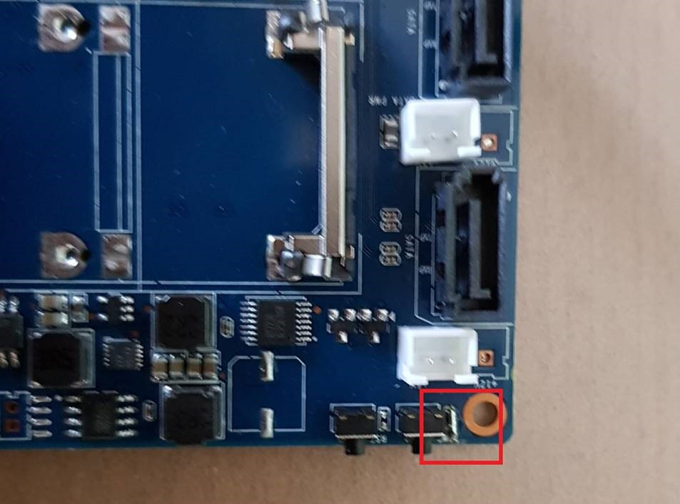

## Hardware Setup

### Banana Pi Hardware

#### Bill of Materials

- 1 RE-BA-R2-Set
	- 1 BananaPi-R2 Open Source Smart Router
	- 1 Samsung EVO Plus 32G SD Card + SD Adapter 
	- 1 WiFi Antenna w/ Internal Wire (Part #?)
- 1 BananaPi-R2 Metal Case
	- 1 Metal Case
	- 2 SATA Data Cables
	- 2 SATA Power Cables
	- 1 Bag Screws + Rubber Mounts
	- 1 Case Assembly Instructions
- Power Adapter RoHS 121-7207 VER18US120-JA

#### Assembly Instructions

1. Use case assembly instructions to install the BananaPi-R2 router into the metal case.
	- Install Antenna cable to the case. The External antenna can be left unscrewed to the mount. 
	- SATA Cables and HDD mounting screws are unused.

2. Flash Ubuntu 18.04 SD Card Image

3a. Booting the BananaPi-R2 requires pressing and holding the power button for ~10s.

3b. Solder two pins near power button. This enable auto start of Banana Pi without required press of power button for ~10s.

