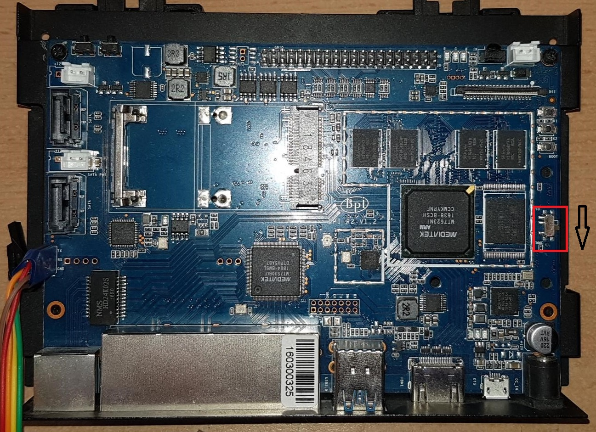

# Tools
Set of tools used on linux host computer.

## create_installation_sdcard.sh

```
Usage: create_installation_sdcard.sh <fluenceimagefile.gz> <Script directory> <SD card Device>
       Full qualified paths are expected for both parameters. Image file must be gzipped.
Example: create_installation_sd.sh ~/Downloads/fluence.img.gz ~/bpi-r2/controller_software/LeafController/BananaPiR2/images  /dev/sdX
```
This script creates a entire installation SD card to put in the BananaPi for automatic installation. 
Insert Master SD Card into the Banana Pi and on the first boot the system will be transfere into eMMC. 
Switch off the Banana Pi and change the small switch located above SD card slot into eMMC position to force next boot from eMMC.



## conv_create_installation_sdcard.sh

Basically calls create_installation_sd.sh as ```sudo```. This convenience is script could be called fromout PATH.

Usage:
```
conv_create_installation_sdcard.sh ~/bpi-r2/backup/fluence_202012221556.img.gz ~/bpi-r2/controller_software/LeafController/BananaPiR2/images /dev/sdb
```

## backupsd.sh

Copy SD card into the file located in ```~/bpi-r2/backup/```. Usage:
```
backupsd.sh
```
The image will be located ```~/bpi-r2/backup/fluence_$TIMENOW.img```
```
backupsd.sh pack
```
The image will be located ```~/bpi-r2/backup/fluence_$TIMENOW.img.tar.gz```
```
backupsd.sh master pack
```
The image will be located ```~/bpi-r2/backup/fluence_$TIMENOW_master.img.tar.gz```

## restoresd.sh
Restore SD card from the file located in ```~/bpi-r2/backup/```. Usage:
```
restoresd.sh fluenceimagefile
```
Fluence image file must be stored inside  ~/bpi-r2/backup/

## cpgit2sd.sh
Copy files from git to mounted SD card on host computer. 

## cpsd2git.sh
Copy files from mounted SD card to git on host computer. 

## Manual Copy Image to eMMC
_Those steps are nov covered in the script_ ```conv_create_installation_sdcard.sh``` _or_ ```create_installation_sdcard.sh```
Steps:
- Copy image to SD card (restoresd.sh)
- Insert SD card to Banana Pi
- Boot Banana Pi from SD Card
- On host computer execute cpimg2remoteemmc.sh
- On Banana Pi execute cpimg2emmc.sh

### Copy image to SD card
With help of restoresd.sh script prepare SD card. Insert empty SD card to your host computer and use the last image from ```~/bpi-r2/backup``` folder.
User could use balenaEtcher to make SD card too.

### Insert SD card to Banana Pi
Insert prepared SD card from prevouus step into Banana Pi

### Boot Banana Pi from SD Card
Start Banana Pi, check ip addres assigned to Banana Pi (```ip a show br0```) it is needed for next step. Test the connection from host computer to the Banana Pi
```
ssh root@IP_Address
```
This will add Banana PI to your known host file.

### cpimg2remoteemmc.sh
Use the script to make from "normal" SD Card, Master SD card usable to flash eMMC.
The script will prepare and copy image from local backup folder to SD Card of remote Banana PI. 
The SD card will be expanded to max available size to hold image what will be push to eMMC. 
The script will copy required files and store them inside ```/root/bpi-r2```on Banana Pi.

```
boris@ubuntu-dell:~/bpi-r2/backup$ cpimg2remoteemmc.sh 
Image file name is missing
Usage: cpimg2remoteemmc.sh fluenceimagefile remote_bpi_IP rootpwd
The file must be stored inside ~/bpi-r2/backup
```

Example
```
boris@ubuntu-dell:~/bpi-r2/backup$ cpimg2remoteemmc.sh fluence_DataStamp.img.gz 192.168.178.XXX rootpwd
```

## infoimg.sh
Size info about image stored inside ```~/bpi-r2/backup```. The image must be not compressed for the analysis.

## makeemptyimg.sh
Make empty SD card appropriate for Banana Pi.

## Mount
Mount image or SD card

### mountimg.sh
### mountsd.sh

## Unmount
Unmount image or SD card
### umountimg.sh -> umountsd.sh
### umountsd.sh
